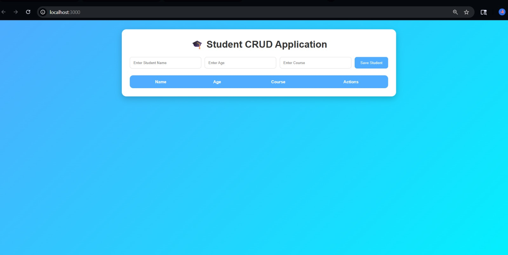
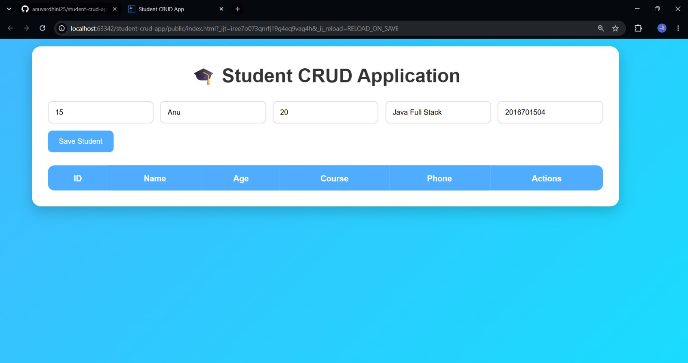
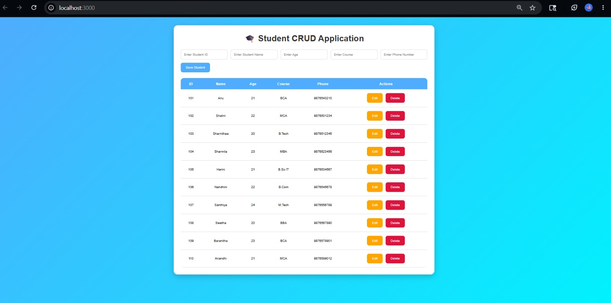
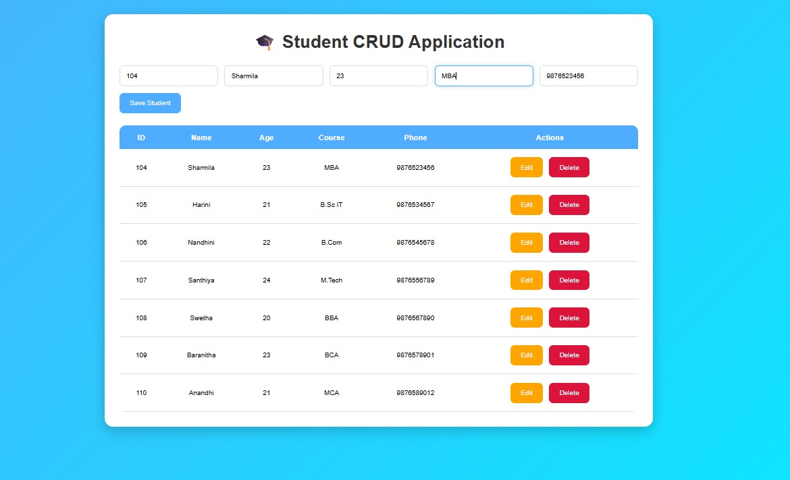
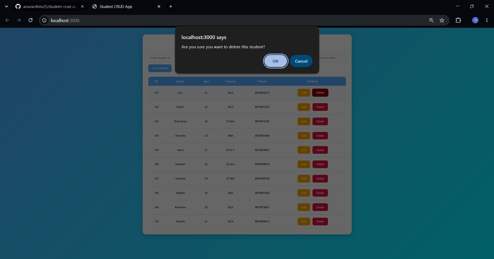
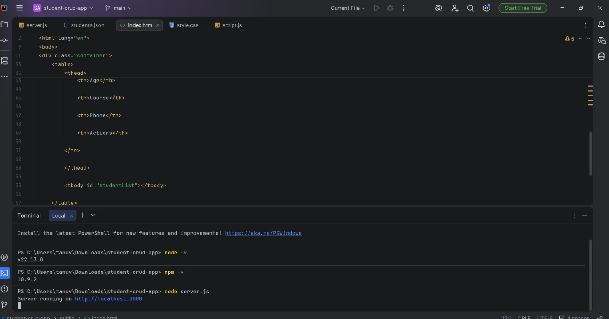

Student CRUD Application

Overview

The Student CRUD Application is a web-based system developed to manage student records efficiently. The application enables users to perform Create, Read, Update, and Delete (CRUD) operations through a structured and user-friendly interface. It serves as a practical implementation of full-stack web development concepts and data management techniques.

Project Functionality

The application provides the following features:

- Add new student records.
- View and manage existing student information.
- Update student details when required.
- Delete student records from the system.
- Store and retrieve data using JSON-based storage.

Technology Stack

Frontend

- HTML5
- CSS3
- JavaScript

Backend

- Node.js

Database

- JSON File Storage ("students.json")
  

## Screenshots

### Application Home Page

### Student Data Entry Form

### Student Details View

### Edit Student Information

### Delete Student Record

### Application Working Demonstration

Key Features

- Complete CRUD Operations
- Simple and Responsive User Interface
- Lightweight Data Management
- Efficient Student Record Handling
- JSON-Based Data Persistence

Learning Outcomes

This project demonstrates:

- Frontend and Backend Integration
- CRUD Operations Implementation
- Data Handling Using JSON
- Server-Side Development with Node.js
- Web Application Development Principles

Developed By

Anuvardhini T
